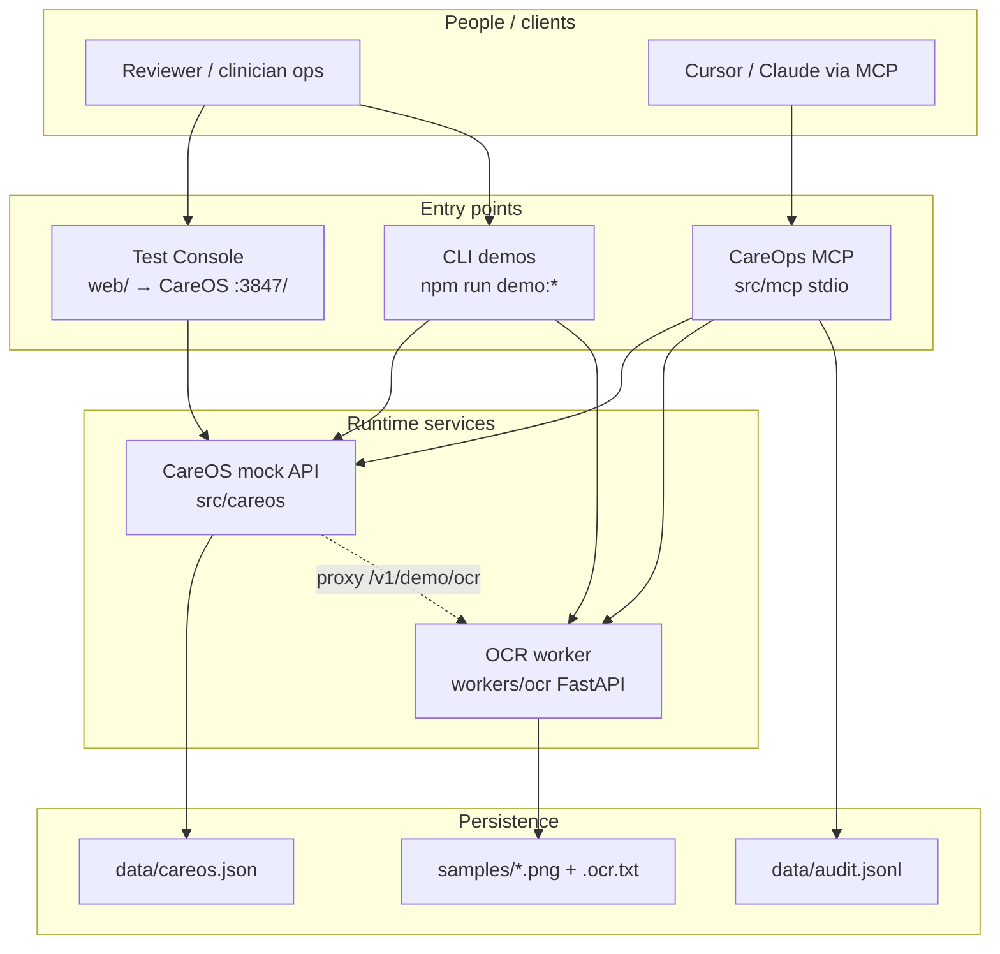
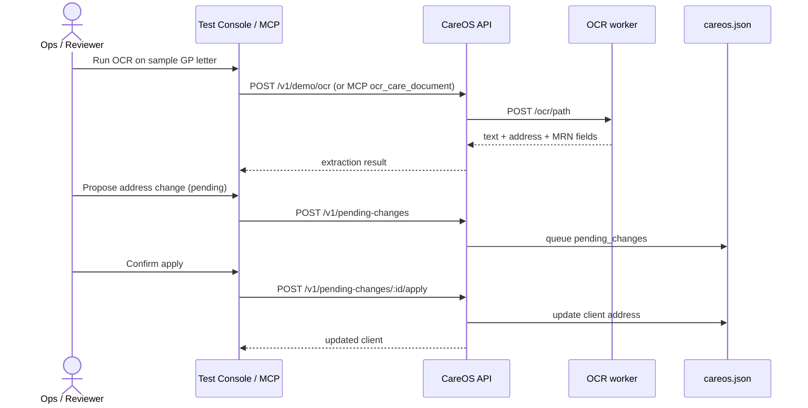
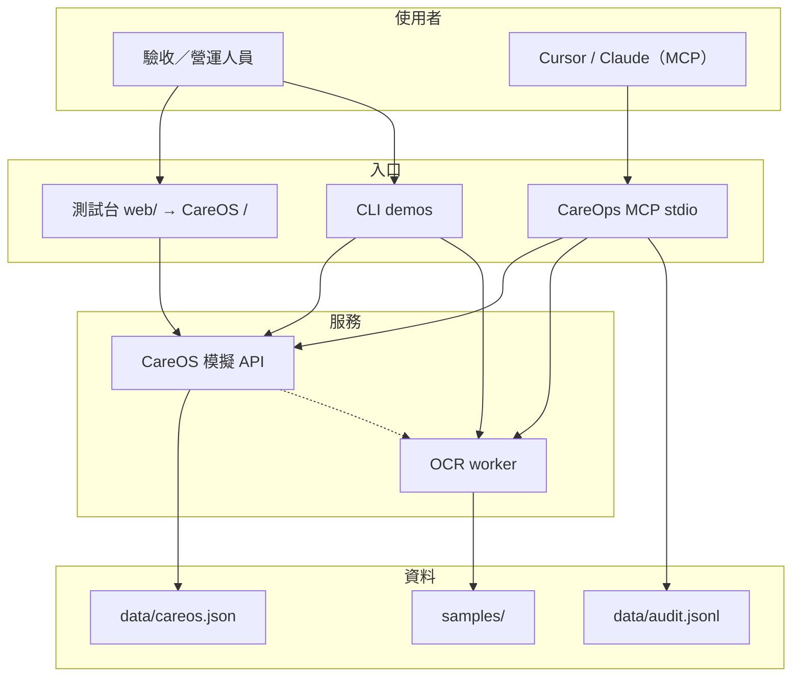

# CareOps MCP

Portfolio project for an **AI Engineer / Software Integrator** role in the **healthcare** industry:

> Quickly map existing clinical systems, then ship production-ready Claude **MCP** tools that automate operational bottlenecks without disrupting daily care.

中文說明見下方 [繁體中文](#繁體中文)。

## What it includes

| Layer | Purpose |
|---|---|
| **CareOS** (`src/careos`) | Mock legacy healthcare platform (HTTP API + JSON DB + messy field names) |
| **CareOps MCP** (`src/mcp`) | Claude / Cursor MCP server: compliance, documents, OCR, address updates, roster dry-run |
| **Python OCR worker** (`workers/ocr`) | FastAPI microservice for scanned letter OCR (Tesseract or demo sidecar) |
| **Pipelines** (`src/pipelines`) | Document ingest + roster conflict suggestions |
| **Security** (`src/security`) | PII masking, optional token gate, audit log |
| **Docker** | Local / test / production Compose stacks |
| **Test Console** (`web/`) | Browser checklist UI served by CareOS at `/` |
| **Docs** | Reverse-engineered system map + privacy notes |

## Architecture (scenario)

How the pieces fit together for a typical healthcare operations demo:



### Example scenario: GP letter → address update



More detail: [`docs/system-map.md`](docs/system-map.md), privacy: [`docs/healthcare-privacy.md`](docs/healthcare-privacy.md).

## Quick start (local Node / Python)

```bash
npm install
npm run careos:seed
npm run careos          # http://127.0.0.1:3847  (terminal 1)

# Python OCR worker (terminal 2)
python3 -m venv .venv
source .venv/bin/activate
pip install -r workers/ocr/requirements.txt
npm run ocr             # http://127.0.0.1:3850
```

## Quick start (Docker)

Requires Docker Engine + Compose v2.

```bash
cp .env.example .env          # optional host port overrides
npm run docker:up             # builds & starts CareOS + OCR
curl -s http://127.0.0.1:3847/health
curl -s http://127.0.0.1:3850/health
```

Stop: `npm run docker:down`

### Connect Cursor while services run in Docker

1. Copy [`demos/cursor-mcp.config.example.json`](demos/cursor-mcp.config.example.json) → `.cursor/mcp.json`
2. Set `cwd` to this repo’s absolute path
3. Keep `CAREOS_URL` / `OCR_URL` on `http://127.0.0.1:3847` and `:3850` (published ports)
4. For OCR paths, prefer repo-relative paths such as `samples/gp-letter-aisha.png` (mounted into the OCR container)

Claude Desktop: [`demos/claude-desktop.config.example.json`](demos/claude-desktop.config.example.json).

```bash
npm run mcp             # optional manual stdio start / debugging on the host
```

### Environments

| Env | Compose files | Purpose |
|---|---|---|
| **Local / dev** | `docker-compose.yml` | Hot-friendly defaults, seed on empty volume, admin OCR helpers on |
| **Test / CI** | `docker-compose.yml` + `docker-compose.test.yml` | Ephemeral volume + `smoke` health/compliance check |
| **Production** | `docker-compose.yml` + `docker-compose.prod.yml` + `.env.prod` | Loopback publish, token required, admin off, path restrict, `no-new-privileges` |

```bash
# Test smoke (exits non-zero on failure)
cp .env.test.example .env.test   # optional
npm run docker:test

# Production-shaped deploy
cp .env.prod.example .env.prod   # set strong CAREOPS_MCP_TOKEN / MCP_AUTH_TOKEN
npm run docker:prod

# First-time prod seed (empty volume only)
CAREOS_SEED_ON_START=1 npm run docker:prod
```

Env templates (safe to commit): `.env.example`, `.env.test.example`, `.env.prod.example`.  
Real files `.env`, `.env.test`, `.env.prod` are gitignored.

## How to test (for customers / reviewers)

Start CareOS + OCR first (local quick start **or** `npm run docker:up`).  
If you remapped host ports in `.env` (e.g. `13847` / `13850`), use those ports below.

### 1. Browser Test Console (recommended)

Open:

- Default: [http://127.0.0.1:3847/](http://127.0.0.1:3847/)
- Remapped example: [http://127.0.0.1:13847/](http://127.0.0.1:13847/)

Static UI lives in [`web/`](web/) and is served by CareOS. Click through:

1. **Health** — CareOS + OCR status  
2. **Clients & compliance** — seeded demo records  
3. **OCR** — sample GP letter `samples/gp-letter-aisha.png`  
4. **Address change** — pending → apply for `CL-1003`  
5. **Roster** — Eastwood overlap dry-run  
6. **Full walkthrough** — runs all steps  

Expect green CareOS/OCR pills and JSON results in the live log.

### 2. CLI demos (no browser)

```bash
npm run demo:compliance   # CareOS compliance smoke
npm run demo:full         # full pipeline walkthrough
npm run demo:mcp          # real MCP stdio client (same path as Cursor)
npm run docker:test       # Compose test overlay + smoke container
```

### 3. Cursor / Claude MCP

1. Configure MCP from [`demos/cursor-mcp.config.example.json`](demos/cursor-mcp.config.example.json)  
2. Point `CAREOS_URL` / `OCR_URL` at your published ports  
3. Ask: *Use `check_compliance_gaps`, then `ocr_care_document` on `samples/gp-letter-aisha.png`*

Interview script: [`demos/WALKTHROUGH.md`](demos/WALKTHROUGH.md).

Inspector:

```bash
npx @modelcontextprotocol/inspector npx tsx src/mcp/index.ts
```

### 4. Raw HTTP checks

```bash
curl -s http://127.0.0.1:3847/health
curl -s http://127.0.0.1:3847/v1/demo/status
curl -s http://127.0.0.1:3850/health
```

## MCP tools

- `search_client_context` — masked client search
- `check_compliance_gaps` — open healthcare compliance checklist items
- `ingest_care_document` — extract fields from CareOS docs (no write)
- `ocr_care_document` — Python OCR worker on a scanned letter image (no write)
- `update_client_address` — pending change → confirm apply
- `apply_pending_change` — human-confirmed write
- `optimize_weekly_roster` — conflict detection (dry-run)
- `run_sync_pipeline` — CareOS connectivity / counts check

Resource: `careops://docs/system-map`

## Python OCR worker

- Service: `workers/ocr/app.py` (FastAPI on `:3850`)
- `OCR_MODE=auto` — use Tesseract if installed, else demo sidecar `.ocr.txt`
- Sample image: `npm run ocr:sample` → `samples/gp-letter-aisha.png`
- Optional real OCR: install [Tesseract](https://github.com/tesseract-ocr/tesseract) + `pip install pytesseract`
- Docker image installs Tesseract; prod sets `OCR_ADMIN_ENABLED=0` and `OCR_RESTRICT_PATH=1`

## Security notes (what not to commit)

Ignored by `.gitignore` / `.dockerignore`:

- `.env`, `.env.prod`, `.env.test`, and other real secret files
- `.cursor/` (local absolute paths / optional tokens)
- `data/*` runtime DB + `audit.jsonl` (may hold demo PII)
- `samples/upload-*`, keys (`*.pem`, `*.key`), `*credentials*.json`
- `docker-compose.override.yml`, `deploy/secrets/`

Set `CAREOPS_MCP_TOKEN` and `MCP_AUTH_TOKEN` to the same value to enable the MCP token gate (required in the prod Compose overlay).

## Job-requirement mapping

| Requirement | Where it shows up |
|---|---|
| Rapid system onboarding | `docs/system-map.md`, CareOS quirky API |
| Healthcare AI applications | compliance / document / roster / OCR tools |
| Real-world MCP | `@modelcontextprotocol/server` + Cursor MCP config |
| Bridge the gap | pending_changes + dry-run pipelines |
| Secure data handling | PII redact + audit log + Docker prod hardening |
| Python **and** TypeScript | TS MCP + Python OCR worker |

## Disclaimer

Synthetic demo data only. Not a clinical system. Privacy notes are orientation, not legal advice.

---

# 繁體中文

針對 **醫療產業** 的 **AI Engineer / Software Integrator** 作品集專案：

> 快速摸清既有醫療／臨床系統，再以可上線等級的 Claude / Cursor **MCP** 工具自動化作業瓶頸，且不干擾日常醫療流程。

## 專案包含什麼

| 層級 | 用途 |
|---|---|
| **CareOS** (`src/careos`) | 模擬舊有醫療平台（HTTP API + JSON DB + 刻意凌亂的欄位名） |
| **CareOps MCP** (`src/mcp`) | Claude / Cursor MCP：合規、文件、OCR、地址更新、班表 dry-run |
| **Python OCR worker** (`workers/ocr`) | FastAPI 微服務，處理掃描信件 OCR（Tesseract 或 demo sidecar） |
| **Pipelines** (`src/pipelines`) | 文件入庫、班表衝突建議 |
| **Security** (`src/security`) | PII 脫敏、可選 token、稽核日誌 |
| **Docker** | 本機／測試／正式 Compose 部署 |
| **Test Console** (`web/`) | 瀏覽器測試台，由 CareOS 在 `/` 提供 |
| **Docs** | 逆向系統圖 + 隱私說明 |

## 架構情境圖

讀者可從下圖理解專案如何串起來（與上方英文 Architecture 相同）：



典型情境（GP 信件更新地址）見英文區 sequence 圖；細節：[`docs/system-map.md`](docs/system-map.md)、[`docs/healthcare-privacy.md`](docs/healthcare-privacy.md)。

## 快速開始（本機 Node / Python）

```bash
npm install
npm run careos:seed
npm run careos          # http://127.0.0.1:3847  （終端 1）

# Python OCR worker（終端 2）
python3 -m venv .venv
source .venv/bin/activate
pip install -r workers/ocr/requirements.txt
npm run ocr             # http://127.0.0.1:3850
```

## 快速開始（Docker）

需安裝 Docker Engine + Compose v2。

```bash
cp .env.example .env          # 可選：調整對外埠號
npm run docker:up             # 建置並啟動 CareOS + OCR
curl -s http://127.0.0.1:3847/health
curl -s http://127.0.0.1:3850/health
```

停止：`npm run docker:down`

### 服務在 Docker、Cursor 在本機

1. 複製 [`demos/cursor-mcp.config.example.json`](demos/cursor-mcp.config.example.json) → `.cursor/mcp.json`
2. 將 `cwd` 改成此 repo 的絕對路徑
3. `CAREOS_URL` / `OCR_URL` 對應你實際對外埠（預設 `3847` / `3850`，若衝突可能是 `13847` / `13850`）
4. OCR 路徑請用相對路徑，例如 `samples/gp-letter-aisha.png`

Claude Desktop：[`demos/claude-desktop.config.example.json`](demos/claude-desktop.config.example.json)。

### 環境對照

| 環境 | Compose | 用途 |
|---|---|---|
| **本機／開發** | `docker-compose.yml` | 空 volume 自動 seed、OCR admin 可用 |
| **測試／CI** | `+ docker-compose.test.yml` | 暫時資料 + `smoke` 健康／合規檢查 |
| **正式** | `+ docker-compose.prod.yml` + `.env.prod` | 僅綁 loopback、強制 token、關閉 admin、路徑限制 |

```bash
npm run docker:test

cp .env.prod.example .env.prod   # 請改成強隨機密鑰
npm run docker:prod

# 正式環境第一次（空 volume）灌種子資料
CAREOS_SEED_ON_START=1 npm run docker:prod
```

可提交範本：`.env.example`、`.env.test.example`、`.env.prod.example`。  
真實密鑰檔 `.env` / `.env.test` / `.env.prod` 已列入 `.gitignore`。

## 客戶／驗收如何測試

先啟動 CareOS + OCR（本機或 `npm run docker:up`）。  
若 `.env` 改過埠號（例如 `13847`），請用對應埠開啟。

### 1. 瀏覽器測試台（建議）

開啟：

- 預設：[http://127.0.0.1:3847/](http://127.0.0.1:3847/)
- 改埠範例：[http://127.0.0.1:13847/](http://127.0.0.1:13847/)

畫面在 [`web/`](web/)，由 CareOS 提供。建議依序點：

1. Health（服務狀態）  
2. Clients & compliance（示範資料）  
3. OCR（範例 GP 信件）  
4. Address change（pending → apply）  
5. Roster（Eastwood 衝突 dry-run）  
6. Full walkthrough（一次跑完）  

成功時 CareOS／OCR 狀態為綠色，下方 log 會顯示 JSON 結果。

### 2. 指令列 Demo

```bash
npm run demo:compliance
npm run demo:full
npm run demo:mcp
npm run docker:test
```

### 3. Cursor / Claude MCP

依 [`demos/WALKTHROUGH.md`](demos/WALKTHROUGH.md) 啟用 MCP 後，在對話中呼叫工具驗證。

### 4. HTTP 煙霧測試

```bash
curl -s http://127.0.0.1:3847/health
curl -s http://127.0.0.1:3847/v1/demo/status
curl -s http://127.0.0.1:3850/health
```

## MCP 工具一覽

- `search_client_context` — 脫敏後的客戶搜尋
- `check_compliance_gaps` — 未完成的醫療合規項目
- `ingest_care_document` — 從 CareOS 文件抽取欄位（不寫入）
- `ocr_care_document` — 透過 Python OCR worker 處理掃描信件（不寫入）
- `update_client_address` — 先 pending，確認後再套用
- `apply_pending_change` — 人工確認後寫入
- `optimize_weekly_roster` — 班表衝突偵測（dry-run）
- `run_sync_pipeline` — CareOS 連線與數量檢查

Resource：`careops://docs/system-map`

## 資安：不要上傳的內容

`.gitignore` / `.dockerignore` 已排除：

- 真實環境變數（`.env`、`.env.prod`、`.env.test`）
- `.cursor/`（本機絕對路徑／可選 token）
- `data/*` 執行期 DB 與稽核日誌
- 上傳暫存、金鑰、憑證檔
- `docker-compose.override.yml`、`deploy/secrets/`

正式 Compose 會要求設定相同的 `CAREOPS_MCP_TOKEN` 與 `MCP_AUTH_TOKEN`。

## 免責聲明

僅使用合成示範資料，非臨床系統。隱私說明僅供方向參考，不構成法律建議。
